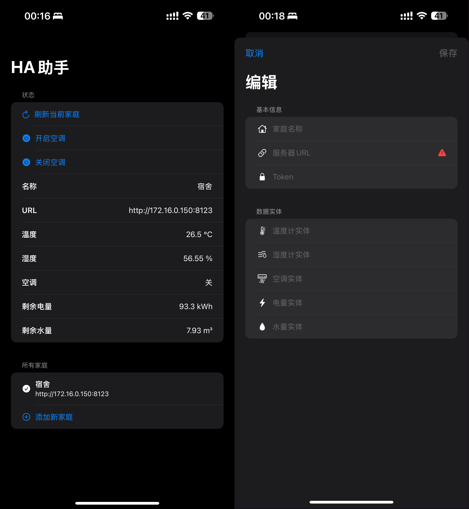

A lightweight utility app for displaying state data and performing operations for Home Assistant in a iOS widget.

You may use this project as a template. The states and services are tailored for my own use.

